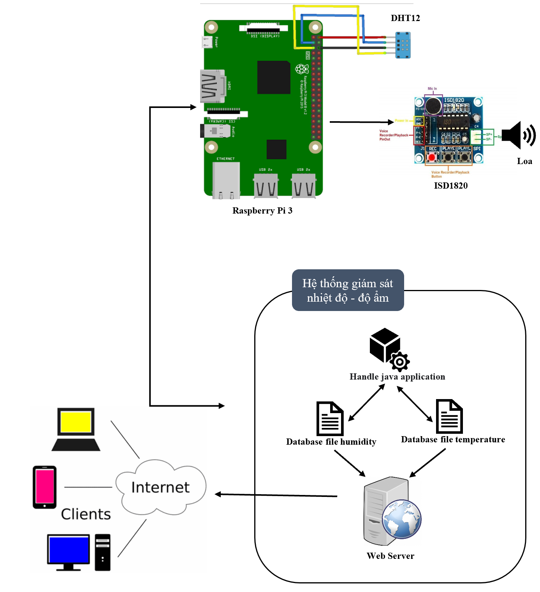
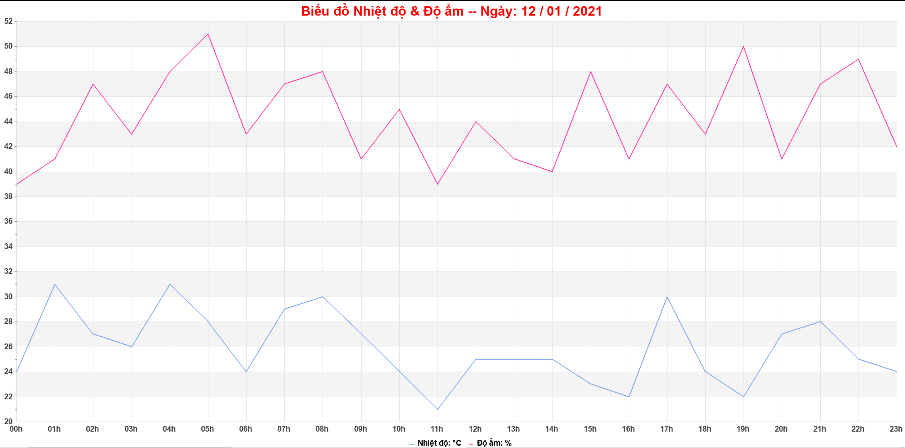

# Smart Home

**_[Language VietNamese]_**

Ứng dụng Smart Home đơn giản được viết trên ngôn ngữ Java và được triển khai trên Raspberry Pi 3, hệ thống sẽ kết nối với 1 hoặc nhiều sensor DHT12 trong nhà để phát hiện nhiệt độ và độ ẩm. Ngoài ra còn có phát ra tính hiệu cảnh báo cháy bằng giọng nói dựa trên module ISD1820. Kết quả nhiệt độ và độ ẩm sau khi thu thập được sẽ lưu lại, và hiển thị kết quả dưới dạng sơ đồ dễ quan sát.

* Architecture diagram Smart Home

## 🔑Features

* Raspberry Pi 3
  * Đọc giá trị nhiệt độ và độ ẩm do sersor DHT12 truyền về dựa trên giao tiếp I2C.
  * Lưu trữ giá trị nhiệt độ và độ.
  * Chạy Web Server.
  * Xử lý giá trị, kích hoạt tính hiệu điện đến module ISD1820 để báo cháy.
* Web Server
  * Hiển thị ngày giờ của giá trị nhiệt độ, độ ẩm thu được.
  * Triển khai biểu đồ đường của nhiệt độ, độ ẩm dựa trên thư viện Jpgraph.
  
  

## 🔧Installation setup

* Để hiểu thêm về giao tiếp I2C, sersor DHT12, cách cài đặt, tài liệu tham khảo. Mời bạn có thể tham khảo tài liệu do tôi viết: [Document](./Document.pdf)

## 📘Main libraries used

*  [Thư viện Java giao tiếp với các chân GPIO trên Raspberry Pi](https://pi4j.com/0.0.5/apidocs/com/pi4j/wiringpi/Gpio.html)
*  [Cài đặt biến môi trường giao tiếp giữa máy tính và Raspberry Pi](https://www.instructables.com/Efficient-Development-of-Java-for-the-Raspberry-Pi/)
*  [Thư viện Jpgraph để vẽ biểu đồ](https://jpgraph.net/)

## 🌏Other Social Media

📌[GitHub](https://github.com/HuygaoBE)

📌[FaceBook](https://www.facebook.com/profile.php?id=100007416721622)

Vui lòng đánh giá sao cho các dự án của tôi trên GitHub, để tôi có thêm động lực để tạo ra nhiều dự án hữu ích cho cộng đồng.
